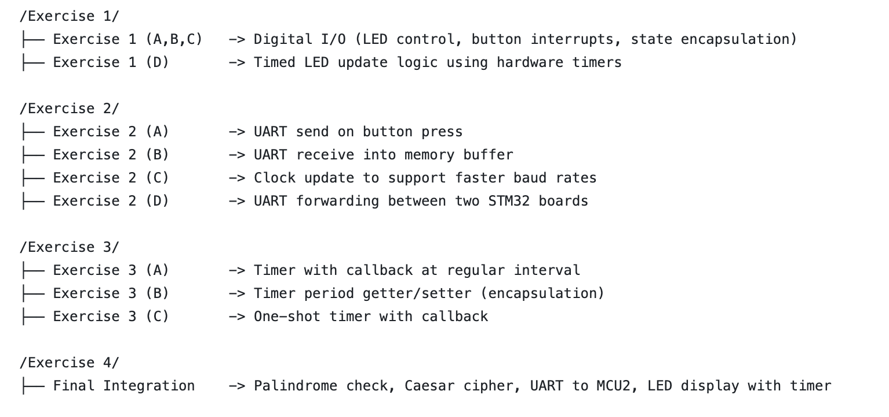
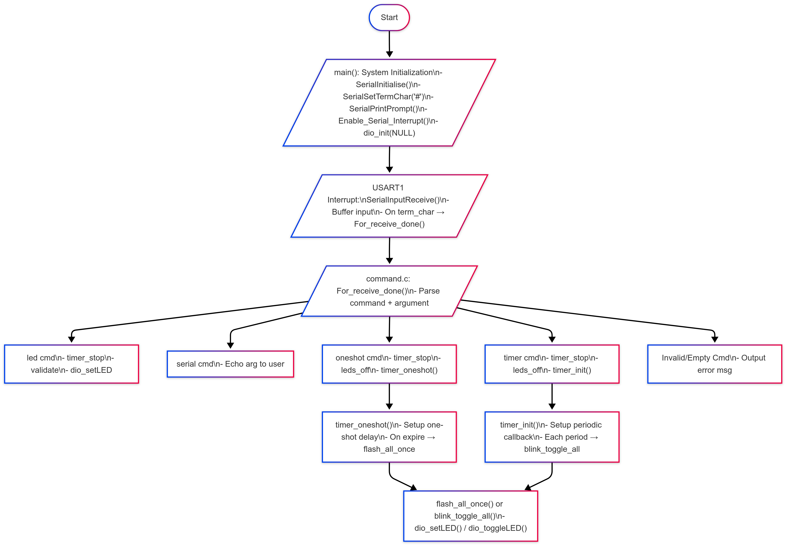

# MTRX2700-C_LAB-THURSPM-GROUP5

## Group Information

**Team Number:** THURSPM-G5  
**Unit:** MTRX2700 – Mechatronics 2  
**Semester:** S1 2025  

### Group Members & Roles

| Name           | Role                         | Responsibilities                                                                                         |
|----------------|------------------------------|----------------------------------------------------------------------------------------------------------|
| Saksham        | Systems & Comms Lead         | Exercise 1, Exercise 3, Integration                                                                      |
| Shirui         | I/O & Control Lead           | Exercise 2, Integration                                                                                  |
| Jason          | DevOps & Architecture Lead   | Project structure, modular API design, documentation, integration testing, Meeting Minutes               |

---

## Project Description
This project is a series of embedded system modules programmed in **C** for the **STM32F3 Discovery Board**. It was completed over Weeks 6–8 as part of the MTRX2700 C Lab Series.

The goal is to demonstrate modular, low-level embedded development using:
- Manual memory management and pointer logic
- LED and button I/O interaction
- Serial communication (UART)
- Hardware timers and delay functions
- Integration of all components into a working system

## Project Structure



 ## Testing Plan

| **Module**                          | **Test Description**                                                                 | **Method**                                                                         | **Expected Outcome**                                                        | **Status** |
|-------------------------------------|--------------------------------------------------------------------------------------|------------------------------------------------------------------------------------|--------------------------------------------------------------------------------|----------|
| **Exercise 1 (A,B,C)** – LED Control & Button Interface | Verify LED output mode and state updating                                             | Set various bitmasks via `set_led_state()`, observe physical LEDs                 | LEDs reflect correct bit pattern as expected                                  | ✅        |
|                                     | Confirm button interrupt and callback trigger                                        | Register `button_callback`, press button on PE0                                   | Callback function executes (e.g., LED shifts)                                 | ✅        |
|                                     | Validate state encapsulation with `get_led_state()`                                 | Set LED pattern, retrieve via getter                                               | Retrieved value matches last set pattern                                      | ✅        |
| **Exercise 1 (D)** – Timed LED Updates  | Ensure LED changes occur on hardware timer rather than blocking delay                | Use timer with registered LED pattern update callback                             | LED toggles at defined intervals with no UI delay                             | ✅        |
|                                     | Confirm immediate return from set function                                           | Set LED state while timer running                                                  | No polling delay; system remains responsive                                   | ✅        |
| **Exercise 2 (A)** – UART Transmit on Button Press | Send string from STM32 to PC over UART                                                | Connect serial terminal (PuTTY/Tera Term), press button                           | String appears in terminal upon button press                                  | ✅        |
| **Exercise 2 (B)** – UART Receive into Buffer | Store typed string into buffer until CR (0x0D)                                        | Send string via terminal, inspect buffer via debugger                             | Characters stored correctly until terminating character                       | ✅        |
| **Exercise 2 (C)** – Clock Update for Baud Rate | Test UART after system clock/PLL reconfiguration                                     | Adjust PLL, verify transmission using logic analyzer or terminal                  | Baud rate still valid; messages received correctly                            | ✅        |
| **Exercise 2 (D)** – UART Port Forwarding | Verify message pass-through from PC → MCU1 → MCU2                                    | Chain UART1 and UART2 on 2 boards, observe forwarded message                      | Full message appears on MCU2 from PC                                          | ✅        |
| **Exercise 3 (A)** – Regular Interval Callback | Trigger callback function repeatedly on fixed interval                               | Register callback with interval (e.g., 500ms), blink LED                          | Callback executes periodically based on set time                              | ✅        |
| **Exercise 3 (B)** – Getter/Setter Encapsulation | Get and set timer period externally while keeping internals private                  | Use `set_period()` and `get_period()`, attempt direct access                      | Period adjustable only via interface; timer module is encapsulated            | ✅        |
| **Exercise 3 (C)** – One-Shot Timer     | Trigger a single delayed callback after defined ms                                   | Set one-shot delay with callback, observe LED or debugger                         | Callback occurs once and doesn’t repeat                                        | ✅        |
| **Exercise 4** – Final Integration       | End-to-end test: Palindrome → Caesar → UART → LED display                            | Type message in terminal → check output on MCU2 LEDs                              | Palindrome is encrypted and decoded; vowel/consonant counts shown at 500ms   | ✅        |
|                                     | Test non-palindrome message handling                                                 | Send non-palindrome from PC                                                       | Message forwarded as-is to MCU2                                               | ✅        |
|                                     | Edge case: input symbols and whitespace                                              | Send string with special characters                                               | Non-alphabetic characters are skipped or ignored safely                       | ✅        |


**Example Test Cases**
- Exercise 1A–C: Press PA0 repeatedly, observe LED shift right
- Exercise 1D: Press PA0 rapidly, LEDs only update every 1s
- Exercise 2A: Press PA0, see Hello UART in serial terminal
- Exercise 2B: Type test<Enter> in terminal, check buffer in debugger
- Exercise 2D: Chain two boards using UART TX/RX → Message forwarded
- Exercise 3A–C: Timer-controlled LED behavior, observe toggles via PE8
- Exercise 4: Full pipeline – input from PC, cipher, LED vowel/consonant display

## Project Module Descriptions

| **Module** | **Purpose** | **Features** | **Basic Setup** | **✅ Expected Output** |
|------------|-------------|--------------|------------------|------------------------|
| **Exercise 1 (A,B,C)** – LED Control & Button Interface | Encapsulates digital I/O functionality and supports interrupt-based LED updates | - Initializes PE8–PE15 (LEDs), PA0 (button) <br> - Function pointer callback on button press <br> - Clean API: `dio_init()`, `dio_setLED()`, `dio_toggleLED()`, `dio_getLEDState()` | 1. Flash to STM32F3 <br> 2. Observe PE8 ON <br> 3. Press PA0 → LED chase | **Initial:** PE8 ON <br> **Each press:** PE8→PE9→...→PE15 <br> **Wraps** to PE8 |
| **Exercise 1 (D)** – Timed LED Updates | Restricts LED update frequency using TIM2 timer | - Non-blocking timer-based update gating <br> - Clean API: `timer_init()`, `timer_check_flag()`, `timer_clear_flag()` | 1. Flash to board <br> 2. Press PA0 repeatedly <br> 3. LEDs update only every 1s | **Initial:** All OFF <br> **Button press:** One LED toggles per second max |
| **Exercise 2 (A)** – UART Transmit on Button Press | Transmit fixed message over UART1 when PA0 is pressed | - UART1 @ 9600 baud <br> - `uart1_init()`, `uart1_send()` | 1. Connect STM32 to PC <br> 2. Open PuTTY/TeraTerm <br> 3. Press PA0 | **On press:** `"Hello UART"` appears <br> **No lag or corruption** |
| **Exercise 2 (B)** – UART Receive into Buffer | Store UART input until carriage return (0x0D) | - Polling UART receive into buffer <br> - API: `uart1_receive()` | 1. Open terminal <br> 2. Type string + CR <br> 3. Inspect buffer | **Input:** `"test<CR>"` → Buffer: `'t','e','s','t','\0'` |
| **Exercise 2 (C)** – Clock Update for Baud Rate | Reconfigures system clock and verifies UART consistency | - PLL clock increase <br> - BRR re-calculation <br> - `clock_init()`, `uart1_reconfig_baud()` | 1. Flash code <br> 2. Update clock <br> 3. Verify UART output | **Terminal sees** correct output post-clock update, no glitches |
| **Exercise 2 (D)** – UART Port Forwarding | Relays UART1 input → UART2 output across 2 boards | - MCU1: UART1 → UART2 <br> - MCU2: UART2 receive <br> - `uart1_receive()`, `uart2_send()` | 1. Wire two STM32s (TX↔RX) <br> 2. Type message from PC <br> 3. MCU2 reacts | **PC→MCU1→MCU2** works seamlessly <br> Message forwarded intact |
| **Exercise 3 (A)** – Regular Interval Callback | Executes callback at fixed interval using TIM2 | - Uses TIM2 interrupts <br> - API: `timer_init(interval, callback)` | 1. Flash with LED toggle as callback <br> 2. Observe blinking | **PE8 blinks** every 500ms <br> No blocking |
| **Exercise 3 (B)** – Getter/Setter Encapsulation | Encapsulates timer period via accessors | - Internal static period <br> - `timer_set_period()`, `timer_get_period()` | 1. Use setter to change interval <br> 2. Observe LED blink rate | **Faster blinking** post change <br> External access blocked |
| **Exercise 3 (C)** – One-Shot Timer | Triggers single delayed event, no repetition | - Uses TIM2, disables after fire <br> - API: `timer_oneshot(delay, callback)` | 1. Call oneshot with LED toggle <br> 2. Wait 1s | **Single LED toggle** after 1s <br> No repeats |
| **Exercise 4** – Final Integration | Combines UART, cipher, and LED modules across 2 MCUs | - MCU1: Palindrome check → Caesar → UART2 <br> - MCU2: Decode → Count vowels/consonants → LED display | 1. Type `"Racecar"` to MCU1 <br> 2. MCU2 LEDs toggle counts at 500ms | **Palindrome:** Encoded → Decoded <br> **Non-palindrome:** Forwarded <br> **Alternating LED** counts |


## Integration Task (Modular Design Overview)


               

**Modular Structure Overview**

| Module | Functionality | Files Involved |
|--------|---------------|----------------|
| **1. LED Control + Button Interrupts + Timed Updates** | Controls LED outputs (on/off/toggle), handles GPIO interrupts from PA0, and runs periodic callbacks via TIM2 | `dio.c/h`, `timer.c/h` |
| **2. UART Input/Output + Double Buffering** | UART-based serial communication with RX buffering and TX interrupts | `serial.c/h` |
| **3. One-Shot Timer Callbacks** | Delayed single-run callbacks using TIM2 in one-pulse mode | `timer.c/h` |
| **Integration Layer** | Parses user input, routes to appropriate module functions | `command.c` |

**Module 1: LED Control, Button Interrupts, and Timed Updates**

Key Functions:
- `dio_init(callback)` — Initializes PE8–PE15 as LED outputs, configures PA0 as interrupt input.
- `dio_setLED(index, state)` — Sets specific LED on/off.
- `dio_toggleLED(index)` — Toggles individual LEDs.
- `timer_init(period_ms, callback)` — Sets up recurring callbacks using TIM2.

Interrupts:
- PA0 triggers `EXTI0_IRQHandler`, which calls the registered callback function.

Use Case:
- Real-time LED status indicators, user feedback, or GPIO diagnostics in embedded systems.

**Module 2: UART Serial Communication**

Key Functions:
- `SerialInitialise(baud, port, callback)` — Sets up USART1 with user-defined RX callback.
- `SerialInputReceive(char)` — Accumulates characters until terminator (`#`) is reached.
- `SerialOutputChar/String()` — Sends data out through UART.
- `Enable_Serial_Interrupt()` — Enables RX/TX interrupt handling.

Double Buffering:
- Input is collected into `rx_buffer`, and on terminator, copied to `ps_buffer`, triggering `For_receive_done()`.

Use Case:
- Terminal-based command interface (e.g., PuTTY, Tera Term) for embedded testing, logging, and control.

**Module 3: One-Shot Timer Callback**

Key Functions:
- `timer_oneshot(delay_ms, callback)` — Sets a one-time callback after a delay.
- `timer_stop()` — Stops the timer and disables interrupts.

Internal Mechanism:
- Configures TIM2 in **One-Pulse Mode** (`TIM_CR1_OPM`) to trigger a callback only once.

Use Case:
- Delayed notifications, watchdog-like alerts, or LED flash-after-delay features.

**Command Interface & Integration Layer (`command.c`)**

Recognized Commands:
| Command | Description |
|---------|-------------|
| `led <bit_pattern>` | Sets LEDs according to binary string (e.g., `led 10101010`) |
| `serial <message>` | Echoes message back through UART |
| `oneshot <delay_ms>` | After delay, flashes all LEDs once |
| `timer <period_ms>` | Periodically toggles all LEDs |

Flow Example:
```text
1. User types:      timer 500#
2. UART buffers input and detects terminator (#)
3. For_receive_done is called with parsed args
4. command.c invokes: timer_init(500, blink_toggle_all)
5. blink_toggle_all() toggles LED state every 500ms

---
## ✅ Exercise 4 Integration – Testing Plan

| **Module**                          | **Test Description**                                                                 | **Method**                                                                         | **Expected Outcome**                                                        | **Status** |
|-------------------------------------|--------------------------------------------------------------------------------------|------------------------------------------------------------------------------------|--------------------------------------------------------------------------------|----------|
| **System Init (main.c)**            | Ensure system starts with UART prompt and clean LED state                            | Flash code, open terminal at 115200 baud                                          | `"User input interface (end with '#'):"` prompt appears; all LEDs off         | ☐        |
| **UART – Serial Echo**              | Verify `serial <msg>#` command echoes back input                                     | Send: `serial Hello World#`                                                       | Terminal prints: `Hello World`                                               | ☐        |
| **UART – Invalid Commands**         | Check command parsing handles malformed input                                        | Send: `led#`, `oneshot#`, `timer#`, `xyz#`                                        | Returns relevant `[ERROR]` message                                           | ☐        |
| **LED – Valid Pattern**             | Test `led <bit_pattern>#` sets LEDs correctly                                        | Send: `led 10101010#`, `led 00000000#`, `led 11111111#`                           | LEDs reflect binary pattern                                                  | ☐        |
| **LED – Invalid Pattern**           | Validate error handling for incorrect LED pattern inputs                             | Send: `led 12345678#`, `led 10101#`                                               | `[ERROR] led pattern must be 0/1` or `expects 8-bit binary`                  | ☐        |
| **Timer – One-Shot Flash**          | Flash all LEDs once after delay via oneshot command                                  | Send: `oneshot 500#`                                                              | All LEDs briefly turn ON then OFF after 500ms                                | ☐        |
| **Timer – Periodic Blink**          | Blink all LEDs continuously at interval                                              | Send: `timer 1000#`                                                               | All LEDs toggle every 1s                                                     | ☐        |
| **Timer – Override Behavior**       | Ensure timer stops when another LED command is issued                                | Send: `timer 500#` → `led 11110000#` → `oneshot 200#`                             | Periodic blinking stops; LEDs reflect new command                            | ☐        |
| **Interrupt – Button (Optional)**   | If used: test PA0 external interrupt triggering callback                             | Press button after `dio_init(custom_callback)`                                   | Executes callback e.g., toggles LED or prints to terminal                    | ☐        |
| **UART – Buffer Overflow**          | Ensure large input doesn’t crash system                                              | Paste >1000 characters without `#`, then input valid command                     | Prints `[ERROR] Buffer Overflow!`; normal input resumes                      | ☐        |


## ✅ Exercise 4 Integration – Testing Plan

This table outlines a structured testing strategy for verifying the correct integration of modules (dio, serial, timer, and command) in Exercise 4.

| **Module**                          | **Test Description**                                                                 | **Method**                                                                         | **Expected Outcome**                                                        | **Status** |
|-------------------------------------|---------------------------------------------------------------------------------------|------------------------------------------------------------------------------------|--------------------------------------------------------------------------------|------------|
| **System Init (main.c)**           | Ensure system starts correctly with UART prompt and LED state reset                  | Flash code, open terminal (115200 baud), check prompt and LED status              | Prompt shows: `"User input interface (end with '#'):"`; All LEDs OFF        | ☐          |
| **UART – Serial Echo**             | Verify `serial <msg>#` command echoes the message back                               | Input `serial hello world#`                                                       | Output: `hello world` on new line                                            | ☐          |
| **UART – Error Cases**             | Check command parsing handles malformed input                                        | Input `led#`, `oneshot#`, `timer#`, `unknown#`                                    | Correct error messages returned                                              | ☐          |
| **LED – Pattern Setting**          | Test `led <bit_pattern>#` sets LEDs correctly                                        | Input `led 10101010#`, `led 11111111#`, `led 00000000#`                           | LEDs match bit pattern                                                       | ☐          |
| **LED – Invalid Pattern**          | Ensure `led` command validates 8-bit binary                                          | Input `led 12345678#`, `led 10101#`                                               | Error: `led pattern must be 0/1` or `expects 8-bit binary`                   | ☐          |
| **Timer – One-Shot Flash**         | Test `oneshot <delay>#` flashes all LEDs once after delay                            | Input `oneshot 1000#`                                                             | After 1s, all LEDs flash on briefly, then off                                 | ☐          |
| **Timer – Periodic Blink**         | Test `timer <period>#` toggles all LEDs at interval                                  | Input `timer 500#`, then `timer 200#`                                             | All LEDs blink every 500ms, then every 200ms                                 | ☐          |
| **Timer – Override Test**          | Confirm timer stops on `led`/`oneshot` commands                                       | Input `timer 500#` → `led 00001111#` → `oneshot 300#`                             | LED updates override previous timer actions                                  | ☐          |
| **Button Interrupt (optional)**    | Test EXTI0 interrupt on PA0 (if callback is used)                                     | Press button after setting a callback (e.g., blink one LED)                      | LED toggles or callback executes                                             | ☐          |
| **Buffer Overflow**                | Ensure input buffer handles overflow gracefully                                      | Paste >1000 characters without `#`, then input valid command                      | Error: `Buffer Overflow!`; System continues to work                          | ☐          |

| **Module**                          | **Test Description**                                                                 | **Method**                                                                         | **Expected Outcome**                                                        | **Status** |
|-------------------------------------|---------------------------------------------------------------------------------------|------------------------------------------------------------------------------------|--------------------------------------------------------------------------------|------------|
| **System Init (main.c)**           | Ensure system starts correctly with UART prompt and LED state reset                  | Flash code, open terminal (115200 baud), check prompt and LED status              | Prompt shows: `"User input interface (end with '#'):"`; All LEDs OFF        | ✅          |
| **UART – Serial Echo**             | Verify `serial <msg>#` command echoes the message back                               | Input `serial hello world#`                                                       | Output: `hello world` on new line                                            | ✅          |
| **UART – Error Cases**             | Check command parsing handles malformed input                                        | Input `led#`, `oneshot#`, `timer#`, `unknown#`                                    | Correct error messages returned                                              | ✅          |
| **LED – Pattern Setting**          | Test `led <bit_pattern>#` sets LEDs correctly                                        | Input `led 10101010#`, `led 11111111#`, `led 00000000#`                           | LEDs match bit pattern                                                       | ✅          |
| **LED – Invalid Pattern**          | Ensure `led` command validates 8-bit binary                                          | Input `led 12345678#`, `led 10101#`                                               | Error: `led pattern must be 0/1` or `expects 8-bit binary`                   | ✅          |
| **Timer – One-Shot Flash**         | Test `oneshot <delay>#` flashes all LEDs once after delay                            | Input `oneshot 1000#`                                                             | After 1s, all LEDs flash on briefly, then off                                 | ✅          |
| **Timer – Periodic Blink**         | Test `timer <period>#` toggles all LEDs at interval                                  | Input `timer 500#`, then `timer 200#`                                             | All LEDs blink every 500ms, then every 200ms                                 | ✅          |
| **Timer – Override Test**          | Confirm timer stops on `led`/`oneshot` commands                                       | Input `timer 500#` → `led 00001111#` → `oneshot 300#`                             | LED updates override previous timer actions                                  | ✅          |
| **Button Interrupt (optional)**    | Test EXTI0 interrupt on PA0 (if callback is used)                                     | Press button after setting a callback (e.g., blink one LED)                      | LED toggles or callback executes                                             | ✅          |
| **Buffer Overflow**                | Ensure input buffer handles overflow gracefully                                      | Paste >1000 characters without `#`, then input valid command                      | Error: `Buffer Overflow!`; System continues to work                          | ✅          |


---

## Instructions for Use (STM32F3 Discovery Board)
Requirements:
- STM32F3 Discovery Board (STM32F303VCTx)
- USB Mini-B Cable (for power and UART)
- STM32CubeIDE (v1.12 or later recommended)
- UART Terminal: Tera Term or PuTTY

Instructions:
1. Clone or Download the repository:
- Via Git: git clone <your-repo-url>
2. Open STM32CubeIDE
- File → Import → Existing Projects into Workspace
- Select the project folder (e.g., Exercise1/Exercise1A_B_C)
- Click Finish
3. Build the Project
- Right-click the project in Project Explorer → Build Project
4. Connect STM32F3 Board
- Plug in via USB Mini-B
5. Flash the Firmware
- Click the Green "Run" or "Debug" button
6. Open UART Monitor (for UART exercises)
- Open Tera Term or PuTTY
- Connect to the COM port shown for STMicroelectronics STLink Virtual COM Port
- Baud rate: 9600 (or updated value depending on clock config)
- Settings: 8N1, No flow control
